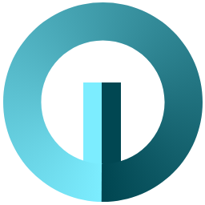
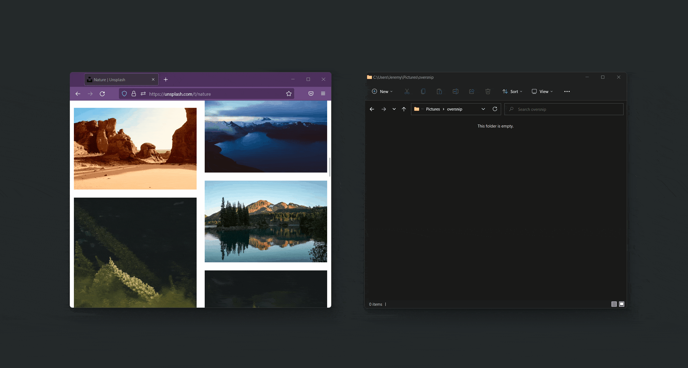
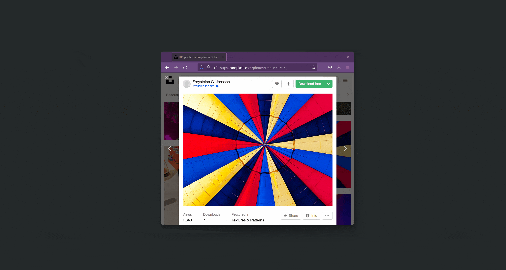
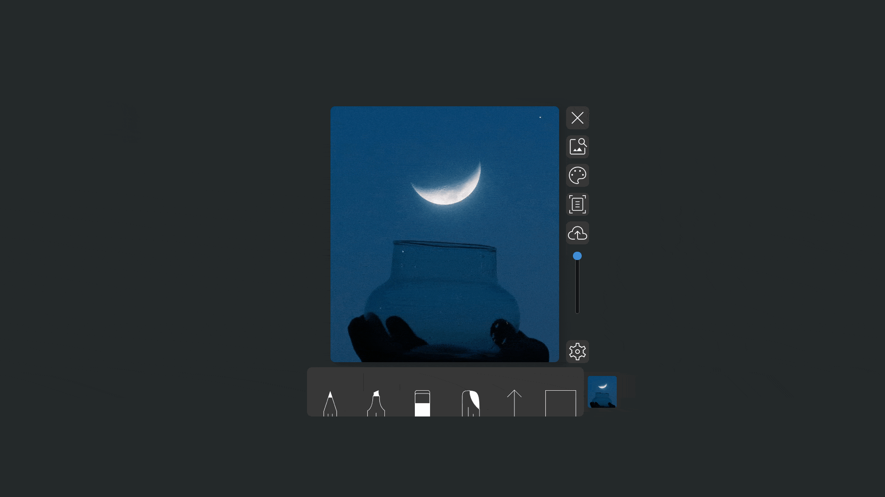
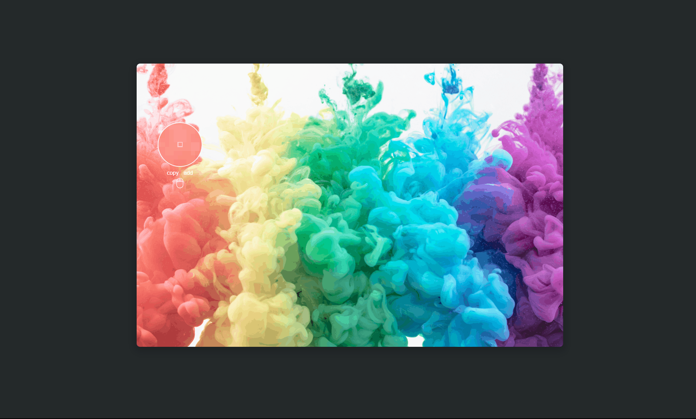
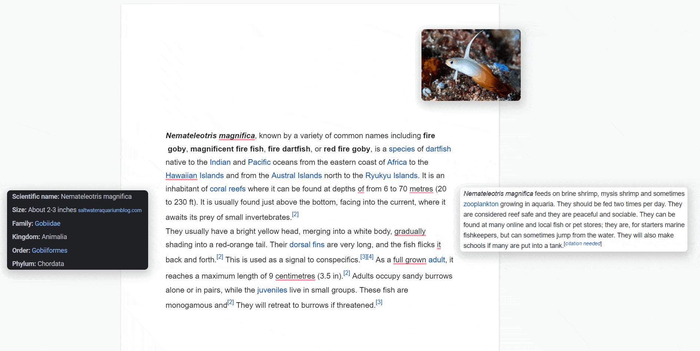

<p align="center"><a href="https://oversnip.com" target="_blank" rel="noopener noreferrer"></a></p>

<p align="center">
  
  
</p>

<h1 align="center"><a href="https://oversnip.com">Oversnip</a></h1>

## Frictionless screenshots on Windows, Mac, and Linux

Oversnip is a modern screenshotting tool that instantly presents a clean UI to rapidly markup and prepare your images for sharing. You don't have to click multiple times or jump through any hoops, just snip and paste/drag wherever you'd like.

<br>


<br><br>

# Features

<h2 style="font-size: 22px">🖼️ Draggable screenshots</h2>

Drag and drop your snips into applications that don't support pasting



<br><br>

<h2 style="font-size: 22px">🔍 Instant image search</h2>

Easily image search any portion of your screen using `Ctrl/Cmd + Alt + I`

<br><br>

<h2 style="font-size: 22px">🎨 Color palette extraction</h2>

Are you a designer? Use oversnip to grab dominant colors in any region of your screen



<br><br>

<h2 style="font-size: 22px">↗️ Re-croppable after the fact</h2>

Missed your initial crop? No worries, extend or contract your snip by dragging from any edge.



<br><br>

<h2 style="font-size: 22px">☁️ One-click upload - <span style="font-size: 16px"> Anonymously upload screenshots to imgur with a single click</span></h2>

<br><br>

<h2 style="font-size: 22px">🌈 Color picker</h2>

Quickly copy any single color from your screen or create multiple floating color cards



<br><br>

<h2 style="font-size: 22px">🎈 Always on top</h2>

Your snips float above other windows and can be used as stencils or glanceable info cards.



<br><br>

## Hackable

Oversnip is open source and powered by Electron. Hop in and make it your own!

<br><br>

## Download

<p align="center">
<a href="https://github.com/AskingQuestions/oversnip/releases/download/v1.0.8/oversnip-1.0.8.Setup.exe"></a>
&nbsp; &nbsp; &nbsp; &nbsp; &nbsp; &nbsp; &nbsp; &nbsp; &nbsp; &nbsp; &nbsp; &nbsp;
<a href="https://github.com/AskingQuestions/oversnip/releases/download/v1.0.8/oversnip-1.0.8-x64.dmg
"></a>
&nbsp; &nbsp; &nbsp; &nbsp; &nbsp; &nbsp; &nbsp; &nbsp; &nbsp; &nbsp; &nbsp; &nbsp; 
<a href="https://github.com/AskingQuestions/oversnip/releases/download/v1.0.8/oversnip-1.0.8_amd64.deb
"></a>

</p>

<br><br>

## Development

```
git clone https://github.com/AskingQuestions/oversnip.git

cd oversnip
npm install
cd oversnip/frontend
npm install

cd ../
npm run dev
```
